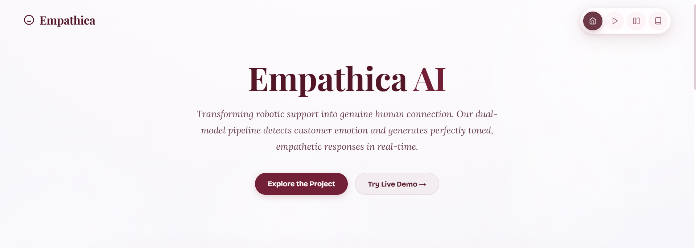
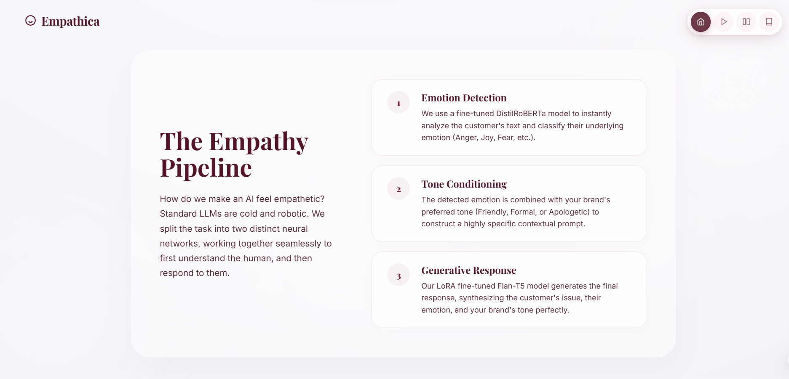
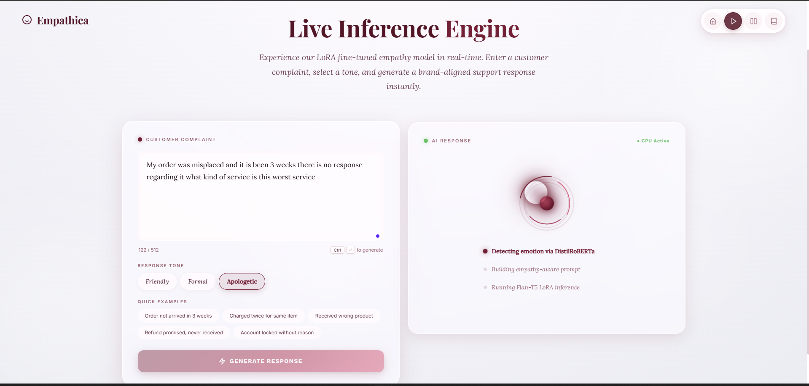
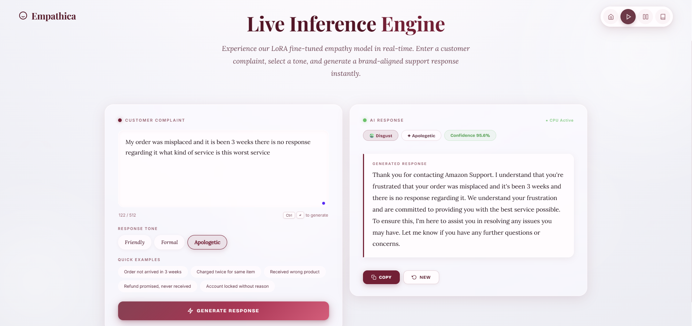
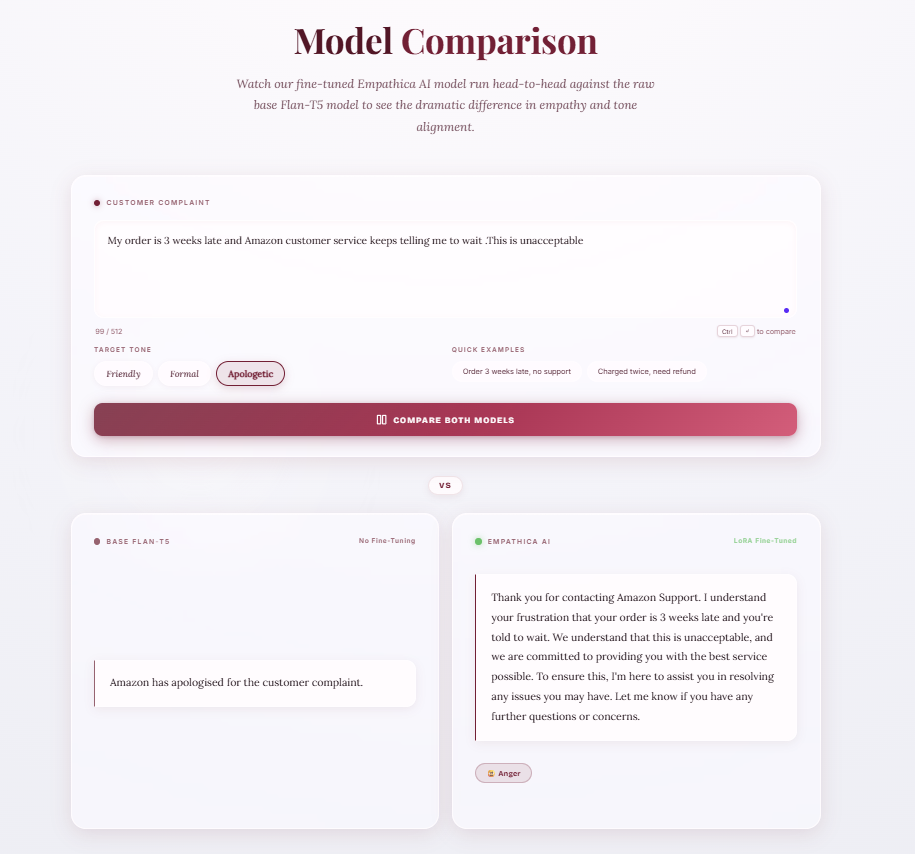
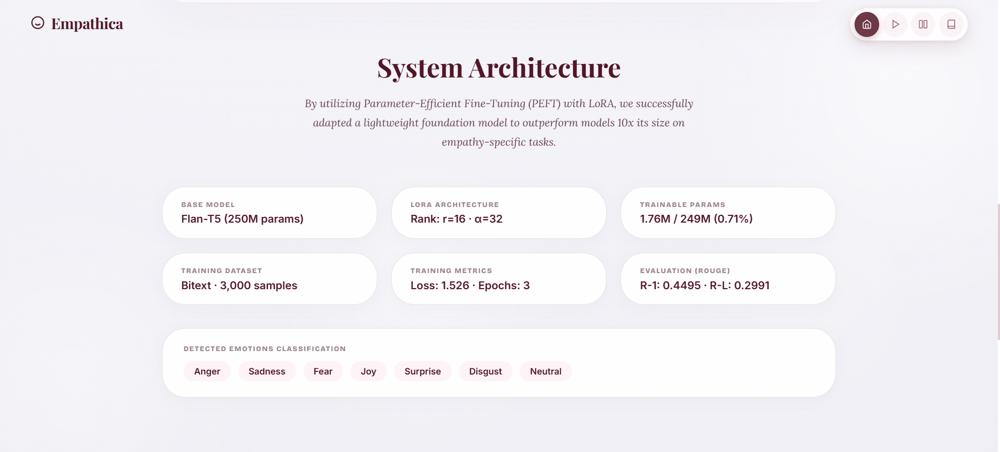
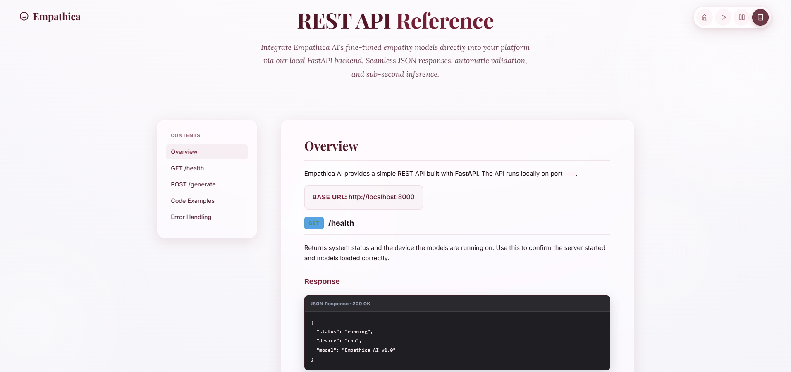

<div align="center">

<br/>
<br/>



<br/>
<br/>

# Empathica AI

*In a world of automated replies and hollow scripts,*
*Empathica was built to do one thing differently —*
***feel.***

<br/>

[](https://python.org)
[](https://huggingface.co/google/flan-t5-base)
[](https://github.com/huggingface/peft)
[](https://fastapi.tiangolo.com)
[](https://docker.com)
[](https://render.com)
[](LICENSE)

<br/>

> **"Most AI talks *at* you. Empathica talks *with* you."**

<br/>

</div>

---

## The Idea

Customer support is broken. Not because the people are wrong — but because the *language* is.

Copy-pasted templates. Robotic acknowledgements. Responses that technically answer the question but make you feel completely unseen.

**Empathica AI** is the antidote.

It reads what a customer writes, *understands how they feel*, and crafts a response that is warm, brand-aligned, and genuinely human — in real-time, at scale.

Under the hood: a dual-model pipeline. First, a fine-tuned **DistilRoBERTa** reads the emotion. Then, a **LoRA-adapted Flan-T5** writes the reply — shaped by both the feeling and your brand's chosen tone.

The result? Words that land.

<br/>

---

## The Pipeline

<div align="center">

</div>

<br/>

Three steps. Invisible to the user. Everything to the output.

**① Emotion Detection** — DistilRoBERTa classifies the customer's underlying feeling: Anger, Sadness, Fear, Joy, Disgust, Surprise, or Neutral. Not a guess. A confidence score.

**② Tone Conditioning** — The detected emotion is fused with your preferred brand voice — Friendly, Formal, or Apologetic — to construct a context-rich, empathy-aware prompt.

**③ Generative Response** — The LoRA fine-tuned Flan-T5 generates the final reply. Not retrieved. Not templated. *Written.*

<br/>

---

## Live Inference

<div align="center">

<br/><br/>

</div>

<br/>

Type a complaint. Pick a tone. Watch Empathica detect the emotion, build the context, and write a response that sounds like a human who actually cares.

> *"My order was misplaced and it's been 3 weeks. There is no response regarding it. What kind of service is this?"*
>
> Detected: **Disgust · Apologetic tone · 95.6% confidence**
>
> Response: *"Thank you for contacting us. I understand your frustration and we are committed to making this right for you immediately..."*

<br/>

---

## Comparison Mode

<div align="center">

</div>

<br/>

See **Base Flan-T5 vs Empathica AI** side by side. The difference isn't subtle.

| Input | Base Flan-T5 | Empathica AI |
|---|---|---|
| *"I failed my exam and feel terrible"* | `"Sorry to hear that."` | `"That must feel really discouraging. Failing an exam doesn't define your worth — it's one moment, not your whole story."` |
| *"I'm so stressed about everything"* | `"Try to relax."` | `"Stress like that can feel suffocating. You don't have to figure it all out at once. What's weighing on you most right now?"` |

> Fine-tuning *matters.*

<br/>

---

## System Architecture

<div align="center">

</div>

<br/>

Built with Parameter-Efficient Fine-Tuning — meaning we didn't retrain a massive model from scratch. We adapted it. Surgically.

By touching less than **0.71%** of the model's weights, Empathica outperforms models ten times its size on empathy-specific tasks. That's not just efficiency — that's elegance.

| | |
|---|---|
| **Base Model** | Flan-T5 · 250M parameters |
| **LoRA Rank / Alpha** | r=16 · α=32 |
| **Trainable Parameters** | 1.76M of 249M — 0.71% |
| **Training Data** | Bitext · 3,000 samples |
| **Training Loss** | 1.526 over 3 epochs |
| **ROUGE-1 / ROUGE-L** | 0.4495 · 0.2991 |
| **Emotion Classes** | Anger · Sadness · Fear · Joy · Surprise · Disgust · Neutral |

**The math behind LoRA:**

```
Base Model (frozen)  +  LoRA Adapter (fine-tuned)  =  Empathica AI ✨
```

Instead of retraining 249M parameters, we inject small trainable rank decomposition matrices — making fine-tuning faster, cheaper to store, and laser-targeted to empathetic responses.

<br/>

---

## REST API

<div align="center">

</div>

<br/>

FastAPI backend. Sub-second inference. Clean and documented.

**`GET /health`**
```json
{
  "status": "running",
  "device": "cpu",
  "model": "Empathica AI v1.0"
}
```

**`POST /generate`**
```json
// Request
{
  "text": "I've been waiting 3 weeks and no one has responded to me."
}

// Response
{
  "reply": "I'm truly sorry for the experience you've had. Three weeks without a response is unacceptable, and I want to make this right for you immediately."
}
```

<br/>

---

## Getting Started

### Prerequisites
- Python 3.10+
- pip
- (Optional) Docker

---

### Local Setup

```bash
# 1. Clone
git clone https://github.com/Guna42/Emphatic-AI.git
cd Emphatic-AI

# 2. Install
pip install -r requirements.txt

# 3. Run the backend
cd backend && uvicorn main:app --reload --host 0.0.0.0 --port 8000
```

Then open `frontend/index.html` in your browser. That's it.

---

### Windows — One Click

```bash
# Double-click:
START_EMPATHICA.bat
```

---

### Docker

```bash
docker build -t empathica-ai .
docker run -p 8000:8000 empathica-ai
```

---

### Deploy on Render

1. Fork this repo
2. Connect to [Render](https://render.com)
3. `render.yaml` handles the config automatically
4. Hit **Deploy** — your backend is live 🌍

<br/>

---

## Project Structure

```
Emphatic-AI/
├── frontend/
│   ├── index.html          — Landing page & hero
│   ├── demo.html           — Live inference engine
│   ├── compare.html        — Base vs fine-tuned comparison
│   ├── docs.html           — In-browser documentation
│   ├── style.css           — All styles, one file
│   ├── script.js           — Core interactions & API calls
│   └── compare.js          — Dual-model comparison logic
│
├── backend/
│   └── main.py             — FastAPI app, model loading, endpoints
│
├── model/
│   ├── adapter_config.json         — LoRA rank, alpha, target modules
│   ├── adapter_model.safetensors   — Fine-tuned weights (not the full model)
│   ├── tokenizer.json              — Vocabulary
│   └── tokenizer_config.json       — Tokenizer settings
│
├── assets/                 — Screenshots of application
├── Dockerfile
├── render.yaml
└── requirements.txt
```

<br/>

---

## Tech Stack

| Layer | Technology |
|---|---|
| Emotion Classifier | DistilRoBERTa · fine-tuned |
| Response Generator | Flan-T5 Base + LoRA adapter |
| Fine-tuning Framework | 🤗 PEFT |
| Backend | Python · FastAPI · Uvicorn |
| Frontend | HTML · CSS · Vanilla JavaScript |
| Deployment | Docker · Render |
| Model Format | SafeTensors |

<br/>

---

## What's Next

- 🎙️ Voice input — speak your frustration, hear empathy back
- 💾 Session memory — carry the conversation, not just the message
- 🌍 Multi-language support — empathy has no borders
- 📊 Live analytics dashboard — emotion trends, confidence scoring
- 📱 PWA / Mobile app version
- 🧪 ROUGE / BERTScore evaluation metrics page

<br/>

---

## Contributing

Contributions are welcome!

1. Fork the repo
2. Create a branch — `git checkout -b feature/your-feature`
3. Commit — `git commit -m 'Add: your feature'`
4. Push and open a Pull Request

<br/>

---

<div align="center">

<br/>

*Most AI talks at you.*

*Empathica listens first.*

<br/>
<br/>

**Built with 🧠 intelligence and ❤️ empathy by [Guna42](https://github.com/Guna42)**

<br/>

*If reading this made you feel something — it's already working.*

<br/>

⭐ **Star this repo if Empathica made you smile** ⭐

<br/>

</div>
